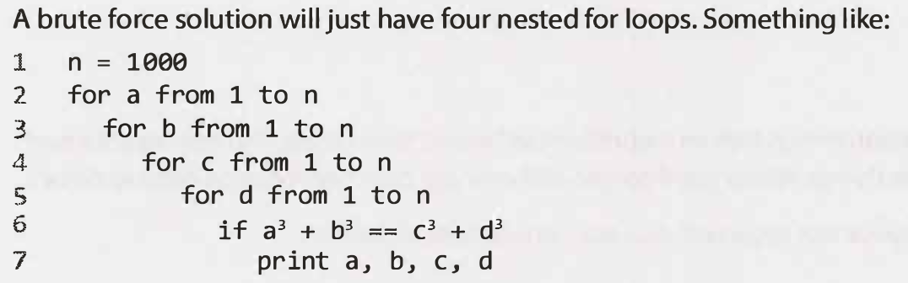
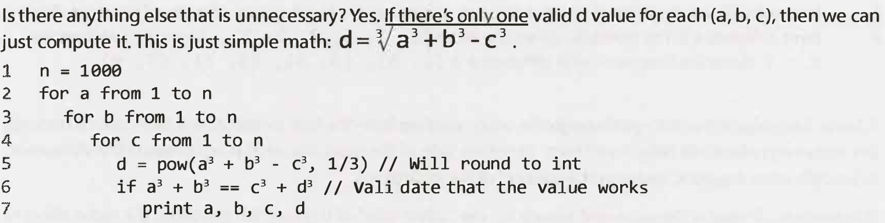

### Set up

python3 -m venv ./venv_alg
source ./venv_alg/bin/activate
export PYTHONPATH="${PYTHONPATH}:./" - 'Rexecute the next command from your project dir'
pip3 install -r requirements.txt


## Cracking the coding interview (algorithms solving advices):

1. **listen carefully** - Yes, you do want to listen to the problem and make sure you heard it correctly. You do want to ask questions about anything you're unsure about.

2. **Draw Example:** When you hear a question, get out of your chair, go to the whiteboard, and draw an example. An example can dramatically improve your ability to solve an interview question

3. **Did you understans the task correctly:** Listen carefully to the problem, and be sure that you've mentally recorded any unique information in the problem.

### Draw example:

1. **Generalize your example:** Be careful. It's very easy to inadvertently draw a special case. Try to make the best example you can. If it later turns out your example isn't quite right, you can and should fix it.

2. **State a Brute Force:** -  It's okay and expected that your initial algorithm won't be very optimal. (You don't want your inter­ viewer to think that you're struggling to see even the easy solution.) It's okay that this initial solution is terrible. Explain what the space and time complexity is, and then dive into improvements.

3. **Recognize algorithms and patterns:** Recognize algorithms and patterns which can be used for the problem solving

4. **Save space on the board:** Implement Start coding in the far top left corner of the whiteboard (you'll need the space). Remember that you only have a short amount of code

5. **One more time** - If you don't understand exactly what you're about to write, you'll struggle to code it!

### 0ptimize your solution

1. **Walk Through the code:** Be sure you have clear vision of the implementation - after you've nailed down an optimal algorithm, don't just dive into coding. Take a moment to solidify your understanding of the algorithm.
Walk through your algorithm and get a feel for the structure of the code. Know what the variables are and when they change.

2. **Precompute information:** Is there a way that you can reorganize the data (sorting, use hashtable, etc.) or compute some values upfront that will help save time in the long run.


3. **Write pseudocode** You can write pseudocode if you'd like. Be careful about what you write, write Basic steps:
- (1) Search array. 
- (2) Find biggest. 
- (3) Insert in heap:

Or brief logic:
("if p < q, move p. else move q") can be valuable. 

But when your pseudocode starts having for loops that are written in plain English, then you're essentially just writing sloppy code. It'd probably be faster to just write the code.


## Optimize&SolveTechnique :Lookfor BUD (Bottlenecks, Unnecessary work, Duplicated wor) 

1. **Bottlenecks:** A bottleneck is a part of your algorithm that slows down the overall runtime. 
For example, suppose you have a two-step algorithm:
- The first step isO(N log N) 
- The second step is O(N). 

The first step O(N log N) is the bottleneck despite you improve your second step O(n) to O(1)

2. **Unnecessary work**





3. **Duplicated work**
DRY - Do not Repeat Yourself.


## Optimize & Solve Technique #3: Simplify and Generalize

1. **simplify constraint** - simplify or tweak some constraint, such as the data type

2. **simplify the task** - We can solve the simplified ransom note problem with characters by simply creating an array and counting the characters. Each spot in the array corresponds to one letter. 

## Optimize & Solve Technique #4: Base Case and Build

1. 


## What Good Coding Looks Like

1. **Correct:** The code should operate correctly on all expected and unexpected inputs.

2. **Efficient:** The code should operate as efficiently as possible in terms of both time and space. This "effi­
ciency" includes both the asymptotic (big O) efficiency and the practical, real-life efficiency. 

3. **Simple:** If you can do something in 10 lines instead of 100, you should. Code should be as quick as possible for a developer to write.

4. **Readable:** A different developer should be able to read your code and understand what it does and how it does it. Readable code has comments where necessary, but it implements things in an easily understandable way. That means that your fancy code that does a bunch of complex bit shifting is not necessarily good code.

5. **Maintainable:** Code should be reasonably adaptable to changes during the life cycle of a product and should be easy to maintain by other developers, as well as the initial developer.

## Use Data Structures Generously

**bad implementation:**
def sum(double[] expr1, double[] expr2) 

**good implementation:**
class ExprTerm {
double coefficient;
double exponent;
}
def sum(ExprTerm[] exprl, ExprTerm[] expr2)

Somemight(andhave)arguedthatthisis"over-optimizing:'Perhapsso,perhapsnot.Regardlessofwhether you think i t 's over-optimizing, the above code demonstrates that you think about how to design your code and don' t just slop something together in the fastest way possible.

## Appropriate Code Reuse

## Modular

**Good example:**
```python
def add(a, b):
    """Add two numbers."""
    return a + b

def subtract(a, b):
    """Subtract two numbers."""
    return a - b

def multiply(a, b):
    """Multiply two numbers."""
    return a * b

def divide(a, b):
    """Divide two numbers."""
    if b == 0:
        raise ValueError("Cannot divide by zero.")
    return a / b

def main():
    # Example usage of the modular functions
    x = 10
    y = 5

    print(f"{x} + {y} = {add(x, y)}")
    print(f"{x} - {y} = {subtract(x, y)}")
    print(f"{x} * {y} = {multiply(x, y)}")
    print(f"{x} / {y} = {divide(x, y)}")

if __name__ == "__main__":
    main()
```


**Bad example:**
```python

def perform_operations(a, b):
    # Performing addition
    add_result = a + b
    print(f"{a} + {b} = {add_result}")

    # Performing subtraction
    subtract_result = a - b
    print(f"{a} - {b} = {subtract_result}")

    # Performing multiplication
    multiply_result = a * b
    print(f"{a} * {b} = {multiply_result}")

    # Performing division, without proper error handling
    if b != 0:
        divide_result = a / b
        print(f"{a} / {b} = {divide_result}")
    else:
        print("Cannot divide by zero.")

# Example usage
x = 10
y = 5
perform_operations(x, y)


```

